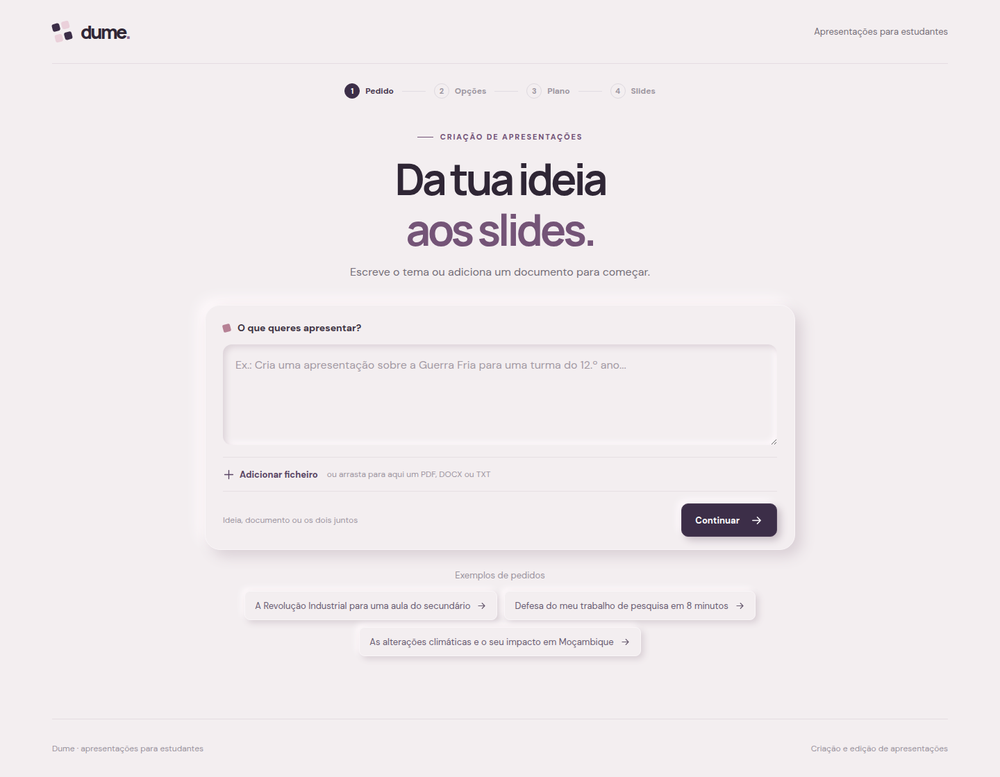
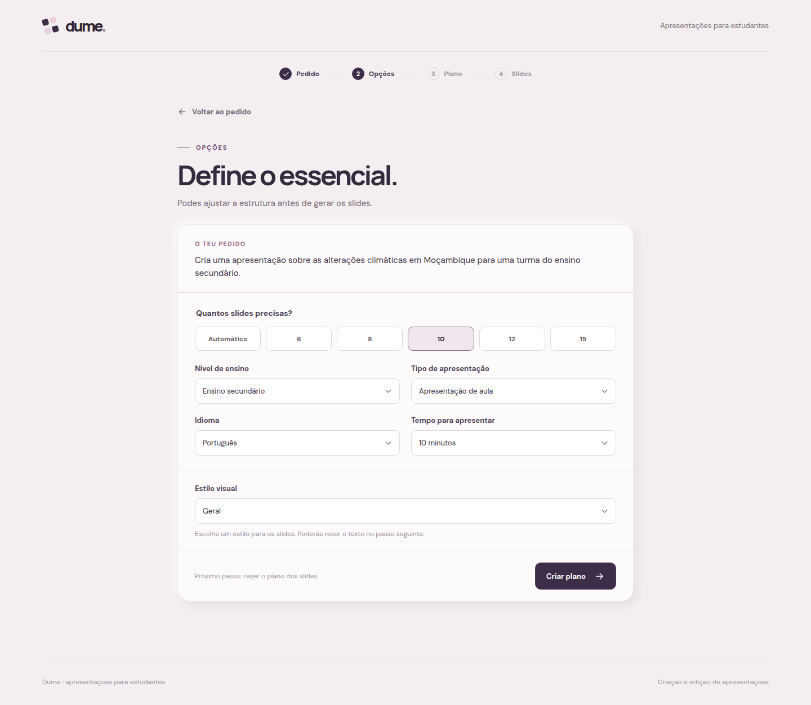
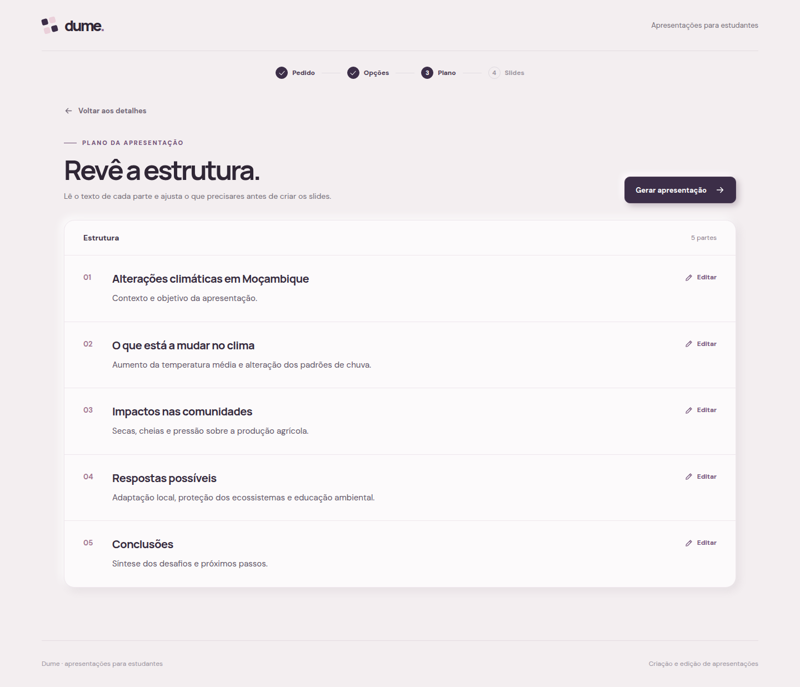
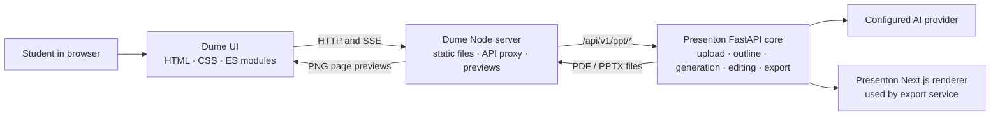

# Dume — Academic Presentation Builder

**A student-first interface for turning a topic or source document into an editable academic presentation.**

Dume is a product and engineering prototype built around one focused journey: describe an assignment, review its outline, watch slide content arrive as it is generated, refine the deck, and export it. It uses the existing [Presenton](https://github.com/presenton/presenton) generation engine instead of reimplementing document parsing, slide generation, rendering, or export.

**Project by [Clesio Juma](https://github.com/ClesioJuma) · Mozambique**

> The screenshots below show the interface with sample content. This repository is source code, not a hosted live demo. Live generation requires a running Presenton backend and its configured AI provider.

## Product walkthrough

| 1 · Start with an assignment | 2 · Set academic context |
|:--:|:--:|
|  |  |

| 3 · Review the outline before creating slides |
|:--:|
|  |

The outline screenshot uses example content to show the review experience. It does not represent a live AI generation run.

## The problem this prototype explores

Presentation generators often expose a broad set of technical controls before students can express what they need. Dume tests a narrower interaction: keep the assignment at the center, let students add a document and presentation context, and make the generated structure readable and editable before slide rendering begins.

The visual direction uses a restrained rose and plum palette with subtle neumorphic surfaces. The review step is a plain text outline list because the slides have not been rendered yet; the later editor shows rendered slide previews.

## End-to-end flow

1. **Describe the task:** enter a topic, add a PDF/DOCX/TXT/Markdown file, or combine a document with extra instructions.
2. **Set useful academic options:** choose slide count, education level, presentation type, language, duration, and a real template returned by Presenton.
3. **Review the outline:** edit each section's title and supporting text before committing to slide generation.
4. **Follow generation:** receive Presenton's server-sent events and display completed slide text progressively, including asset status.
5. **Edit and export:** inspect rendered pages, edit text, request a slide rewrite, change slide order or structure, and download PDF or PPTX.

## Architecture



The Dume server binds to `127.0.0.1:3020` and proxies `/core/api/v1/ppt/*` to the FastAPI service. It also turns exported PDF pages into PNG previews with `pdftoppm`. The browser never receives the provider credential; provider setup belongs to the Presenton backend.

### Decisions visible in the code

- **Reuse the generation engine:** Dume is a separate student experience, not a fork of Presenton's dashboard or a replacement for its core services.
- **Translate academic intent at the boundary:** [`academic-adapter.js`](academic-adapter.js) maps student-facing choices into Presenton's creation payload and adds level, presentation type, and duration as generation instructions.
- **Keep integration in one client:** [`core-client.js`](core-client.js) centralizes upload, outline, templates, generation, editing, and export-related requests rather than scattering fetch calls through the UI.
- **Handle streamed output in the browser:** the client reads SSE with the Fetch Streams API, buffers partial frames, and forwards progress events to the generation view without adding a streaming dependency.
- **Keep previews aligned with exported output:** the Node bridge requests a PDF from Presenton, converts pages to PNG, caches finished previews, and shares an in-flight preview job for duplicate requests.
- **Preserve the chosen slide layout when adding content:** the current add-slide flow starts from an existing slide structure and asks Presenton to regenerate its content, instead of creating another slide-generation implementation.

### Integration contract

The browser calls the Dume bridge under `/core/api/v1/ppt`. The academic adapter produces the request for `POST /presentation/create` with `content`, `n_slides`, `language`, `file_paths`, `tone`, `verbosity`, `instructions`, `include_table_of_contents`, `include_title_slide`, `web_search`, and `generation_mode`. The remaining flow uses the Presenton routes below:

| Presenton route | Dume uses it for |
|---|---|
| `POST /files/upload` | Uploading a source document and receiving paths for the create request |
| `POST /presentation/create` | Creating a presentation record from the adapted academic request |
| `GET /outlines/stream/{id}` and `PUT /outlines/{id}` | Receiving and saving the reviewable outline |
| `GET /template/all` and `POST /presentation/prepare` | Loading available templates and associating the selected layout before generation |
| `GET /presentation/stream/{id}` | Receiving slide content and asset status through SSE events |
| `POST /presentation/slide/text`, `POST /slide/edit`, `PATCH /presentation/update` | Saving text, regenerating a slide, and persisting slide structure changes |
| `POST /presentation/{id}/export` | Producing the PDF used for previews and PDF/PPTX downloads |

The Dume server adds `/api/preview/{id}`, `/api/preview-image/{id}/{page}`, and `/api/download/{id}/{format}` for browser-friendly preview and download responses.

## Stack

| Area | Choice | Why it is here |
|---|---|---|
| Frontend | HTML, CSS, browser-native JavaScript ES modules | Small independent interface with no build step or frontend framework runtime |
| Local web server | Node.js built-in HTTP, streams, filesystem, and `fetch` APIs | Serves the app and bridges browser requests to Presenton, including SSE |
| Presentation engine | Presenton FastAPI | Existing document processing, outlines, slide generation, editing, and export |
| Slide previews | PDF export + Poppler `pdftoppm` | Uses the renderer's actual output for previews instead of recreating slide layouts in Dume |
| Export | Presenton PDF/PPTX export | Keeps final files on the existing export pipeline |

There are no npm runtime dependencies in this prototype. `package.json` uses Node's native ES module support and starts `server.mjs`.

## Run locally

This checkout contains the Dume interface and bridge. Run it alongside a configured Presenton checkout. The FastAPI backend, Presenton Next.js renderer, export runtime, and AI provider must already be configured as required by Presenton.

1. Install Node.js and Poppler (`pdftoppm`) on the Dume host.
2. Start the Presenton FastAPI backend and renderer. Configure its `USER_CONFIG_PATH`, `NEXT_PUBLIC_URL`, `EXPORT_PACKAGE_ROOT`, and, if needed, `PUPPETEER_EXECUTABLE_PATH`.
3. Use an `APP_DATA_DIRECTORY` visible to both Dume and FastAPI (the same local directory or a shared volume).
4. Start Dume:

   ```bash
   APP_DATA_DIRECTORY=/path/to/shared-data \
   DUME_CORE_URL=http://127.0.0.1:8767 \
   npm start
   ```

5. Open [http://127.0.0.1:3020](http://127.0.0.1:3020).

The URL `/?id=<presentation-uuid>` reopens a presentation when its data remains available to Presenton.

## Scope and current limitations

- This is a local product prototype. There are no accounts, authorization, multi-user isolation, or shared presentation history.
- The server intentionally binds to loopback. Do not expose it directly to the public internet; a deployed pilot needs HTTPS and an access-control layer in front of it.
- The editor supports text changes and slide-level actions, but is not a direct-manipulation canvas for positioning elements, fonts, or colors.
- Preview refresh exports the presentation again and rasterizes the PDF, so it can take longer than an in-browser slide renderer.
- Image generation depends on the configured provider and its quota. A provider quota error can leave a slide without its intended image.
- No automated test suite or CI workflow is included in this demonstration repository yet.

## Source map

| File | Responsibility |
|---|---|
| [`app.js`](app.js) | Product flow, view state, outline review, live generation feedback, editor interactions |
| [`academic-adapter.js`](academic-adapter.js) | Student-facing options → Presenton creation request |
| [`core-client.js`](core-client.js) | Central API client and SSE frame reader |
| [`server.mjs`](server.mjs) | Static server, FastAPI proxy, PDF page previews, safe export downloads |
| [`styles.css`](styles.css) | Dume visual system, responsive layouts, interaction states |
| [`index.html`](index.html) | Browser entry point, fonts, app mount |

---

This is a demonstration of product thinking and integration work around an existing presentation engine. The prototype keeps the student-facing workflow small while leaving generation and export responsibilities with the system already built to do them.
